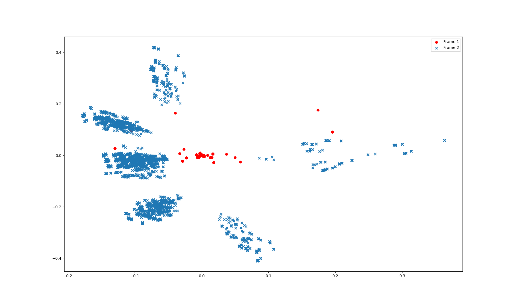
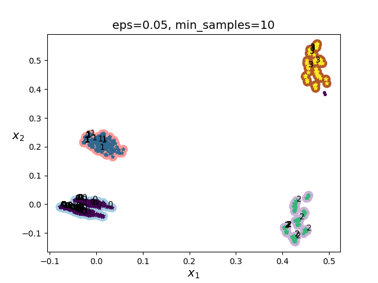
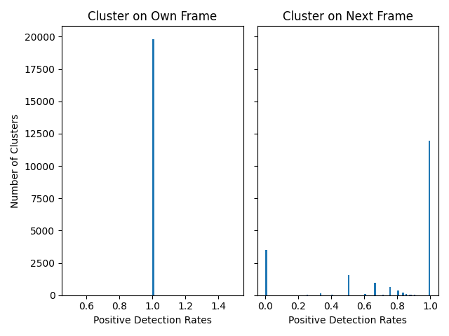
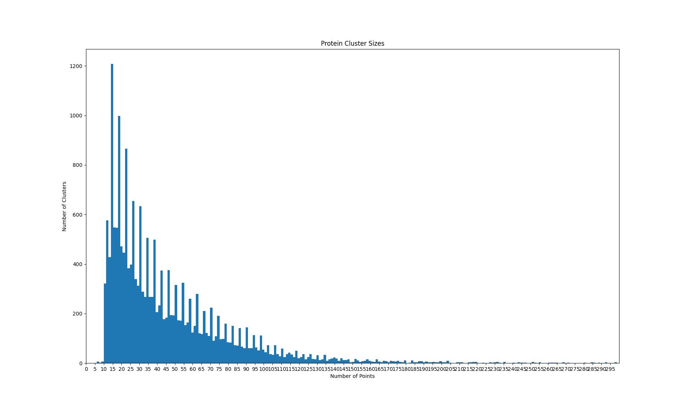
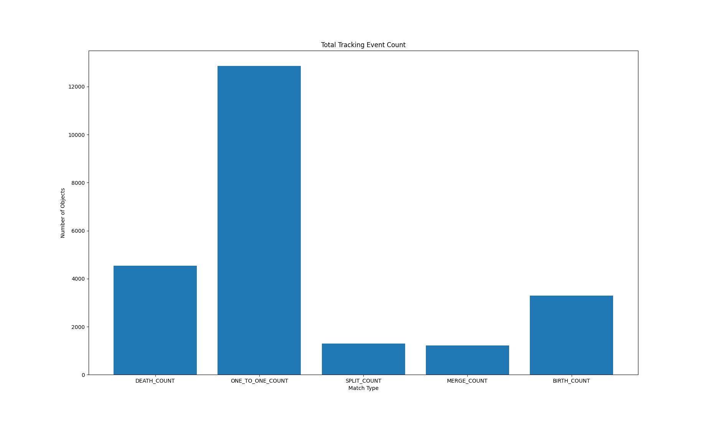

# protein_tracking_research


Research to track segmented 3d images of protein clusters.

2019 CVPR. Multi-Object Portion Tracking in 4D Fluorescence Microscopy Imagery with Deep Feature Maps. Paper link: http://openaccess.thecvf.com/content_CVPRW_2019/papers/CVMI/Jiao_Multi-Object_Portion_Tracking_in_4D_Fluorescence_Microscopy_Imagery_With_Deep_CVPRW_2019_paper.pdf


### Results on Synthetic Sprites Dataset
Raw Sprites Dataset | Labeled Sprites Dataset
-------------------- | -----------------------
 | 

Not a perfect demostration as annotated datasets with many to one or one to many tracking are non-existent. Full video in ./data 

### Feature Embeddings Clustering
Protein Dataset 2D Distribution | Protein Dataset Clustering
------------------------ | ---------------------------
  |  

In the left image we see the 2D mapping of the feature embeddings. In the right image we see each cluster labled by DBSCAN. The cluster classes have sizes:

Class Labels | Cluster Sizes 
------------ | -------------
0 | 16773
1 | 994
2 | 2472
3 | 281

Total feature embeddings: 10260
 

### Set Up Enviroment

To set up python3 virtual env.

```

/cell_tracking$ python3 -m venv env
/cell_tracking$ source env/bin/activate
/cell_tracking$ pip3 install -r requirements.txt 

```

### Generate Usable Data

This requires the original segmentation results data, from the 2019 CVPR Multi-Object 
Portion Tracking in 4D Fluorescence Microscopy Imagery with Deep Feature Maps paper.

```

/cell_tracking$ python3 data.py --h

```
Running this will generate a numpy dataset from the raw *.nii files. Will save in
/data folder. This is used by the tracker.

### Run Tracker

```

/cell_tracking/src/python$ python3 protein_tracker.py --task train 

/cell_tracking/src/python$ python3 protein_tracker.py --task predict 
```

This will run tracking on the dataset and store the results in data/ as json files.

labled_tracks.pickle: Contains a python dict that holds the tracking results

tracks_frame.json: Json file where the key is the frame number and the value
is a list of every track in that frame.

tracks_pretty.json: Json file where the key is the cluster id and the value
is a list of all the frames that it appears in.


### Tracking Results


  
  

### Visualize Results

Run the Matlab script graph_results.m to label the 3D figs with the tracked ID's.
This uses the json tracking result files. 

Copy labled .fig results to cell_tracking_research/data/labled_frames

```

/cell_tracking_research$ cp ./data/raw_data/Segmentation_and_result/*/*_tracked.fig ./data/labled_frames/

```

Run demo.m or open demo.fig in /data to see tracking results, slide the slider the change frames.


